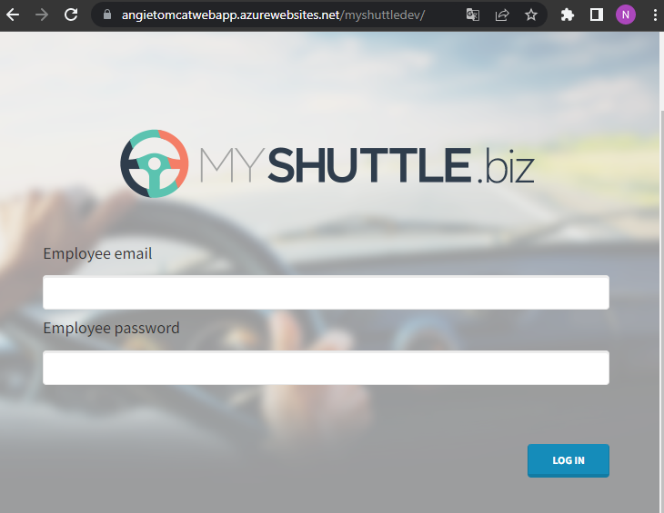
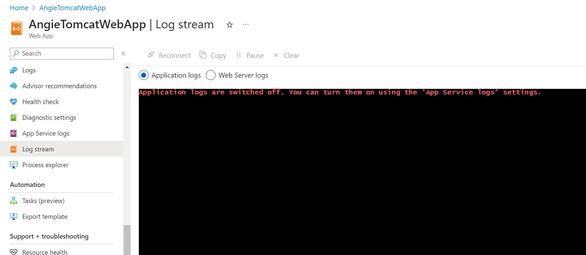
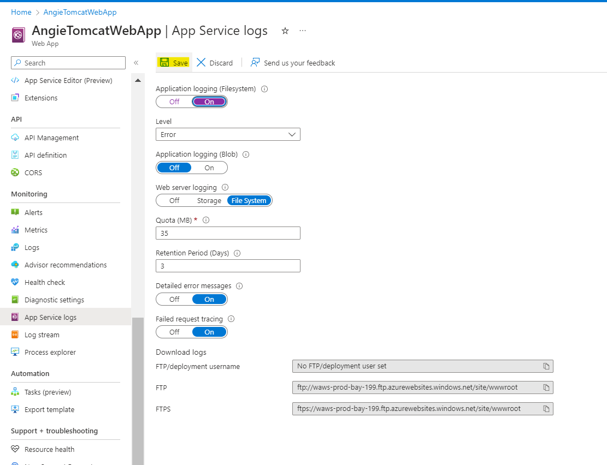
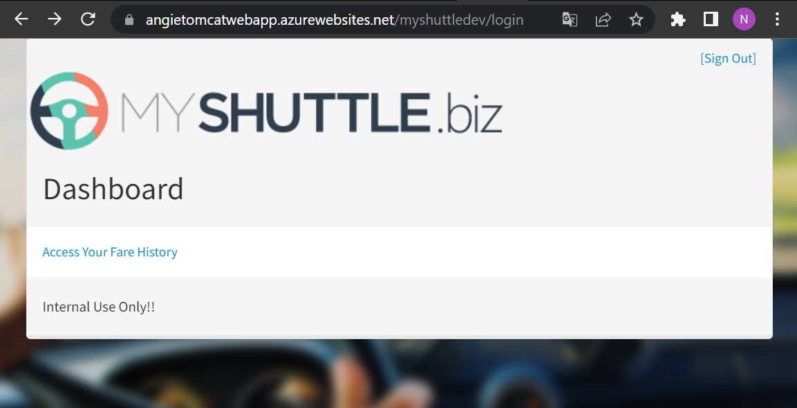
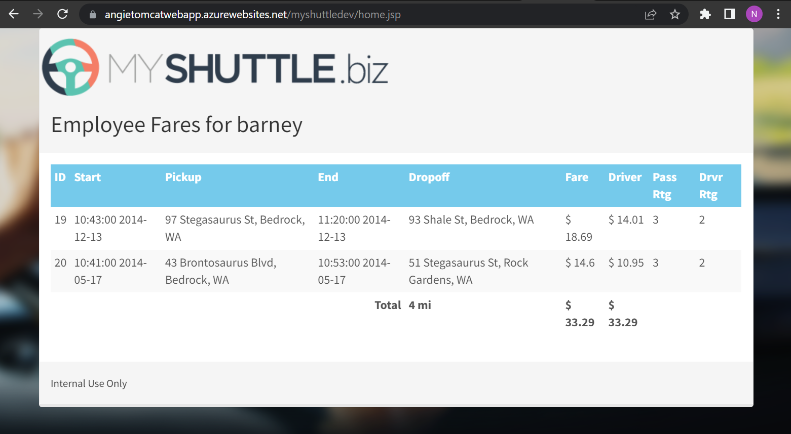
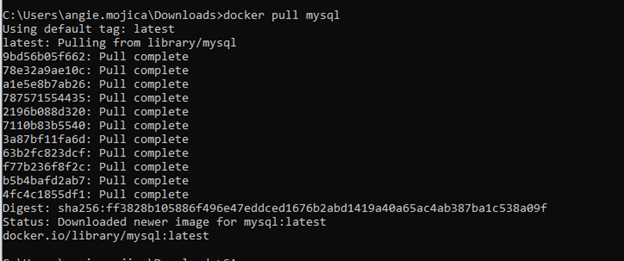
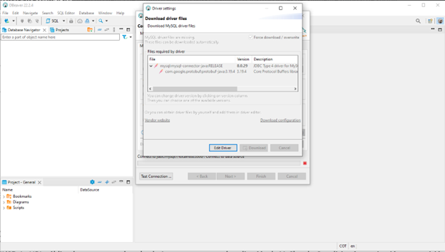
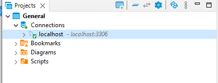
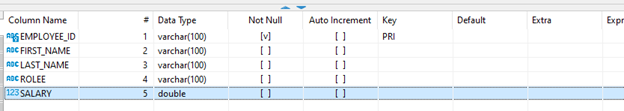
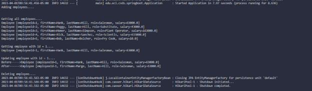

# Laboratorio 7: Finalización CI/CD - Manejo de Data - ORM
Angie Natalia Mojica
### Parte I. FINALIZACIÓN CI-CD
1. Verificar funcionamiento de app MyShutle en la cuenta de la nube Azure.\
https://angietomcatwebapp.azurewebsites.net/myshuttledev


2. Revisión y configuración de logs.\
Se ingresa a la opción de Logs Stream para luego activar y configurar los logs, como se muestra a continuación.\
\
\
A la hora de hacer login se observa el mensaje Internal Server Error.\
Se realiza la descarga del repositorio para poder revisar la información de la base de datos

3. Solucionando un Bug.
Se ha revisado en que parte aparece la información de la base de datos y se actualiza dicha información de conexión. Posteriormente se suben los cambios y se valida el correcto funcionamiento.
```java
public class DataAccess
{
	// Some database-specific details we'll need
	private static final String DB_DRIVER = "com.mysql.jdbc.Driver";
	private static final String DB_URL = "jdbc:mysql://angiefirstsqlserver.mysql.database.azure.com:3306/alm";
	private static final String DB_USER = "angieM@angiefirstsqlserver";
	private static final String DB_PASS = "4N..";
```
\


### Parte II. USANDO SPRING DATA DESDE CERO
1. Se ha creado el repositorio con el proyecto tal y como lo plantea el tutorial de spring de\
https://medium.com/@saultobias13/a-quick-start-with-spring-boot-and-spring-data-jpa-32718a8f4706

2. Se crea una base de datos local usando Docker:
    - Se descarga la imagen de MySQL:

    - Correr el contenedor de MySQL:

    - Descargar un cliente de base de datos:
\

    - Crear tabla EMPLOYEE:

    - Conectar el proyecto de spring a base de datos MySQL:
      ```java
      spring.datasource.url=jdbc:mysql://localhost:3306/sys
      spring.datasource.username=root
      spring.datasource.password=hola123
      spring.jpa.hibernate.ddl-auto = update
      ```
    - Ejecución de la aplicación:

